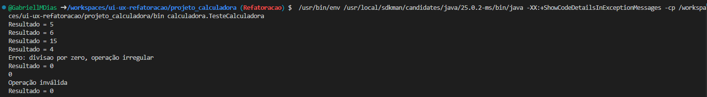
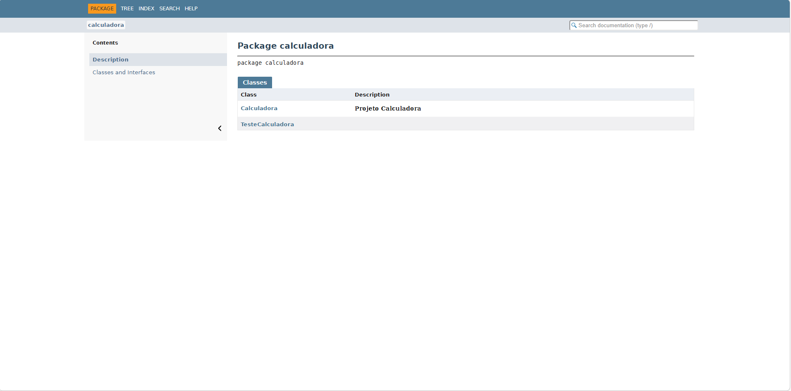

# TESTES FUNCIONAIS, REFATORAÇÃO E DOCUMENTAÇÃO DE SOFTWARE

<strong> Objetivos da atividade </strong> 
Esta atividade tem como objetivo desenvolver a capacidade prática do aluno na construção, validação, manutenção e documentação de software, aplicando conceitos de: testes funcionais; testes unitários;tratam ento de erros; refatoração de código; documentação técnica e versionamento de software.

<strong>Tecnologias utilizadas</strong>
  Java, Javadoc, Github, VSCode.

<strong>Operações</strong>
 Realiza as operações de soma, subtração, multiplicação e divisão.

<strong>Resultado teste:</strong>

<strong>JavaDoc:</strong>
